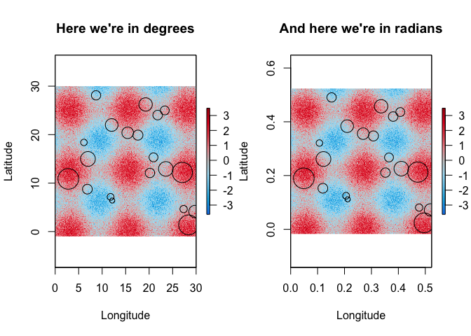
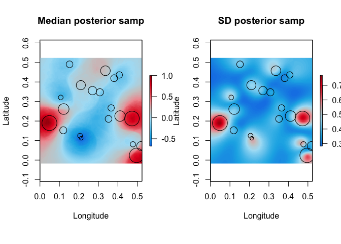

# greta.gp: New features in the fork

Here’s a quick tour of the features I’ve added to this fork of
`greta.gp`. Briefly, they are:

- A new kernel class, `circmat`: the Circular Matern kernel is
  interesting because it allows us to account for the curvature of
  spheres (like Earth). A relative of other Matern kernels. I’m
  intending to use it on continental-scale modelling (where being on a
  sphere starts to become important).

- An accompanying distance function, `great_circle_dist()`: implements
  formula for great circle distance (in radians).

And here’s how they work:

### Great circle distance proof of concept

Great circle distance is defined as follows:

$$\Delta\sigma = \arccos(\sin\phi_1\sin\phi_2 + \cos\phi_1\cos\phi_2\cos\Delta\lambda)$$
$$ d = r\Delta\sigma $$

Where $\lambda_1$ and $\lambda_2$ are the longitude and $\phi_1$ and
$\phi_2$ are the latitude of two points. The *circumference* of the
sphere, $r$, is an argument of `great_circle_dist()` and is set to 1 by
default. Note that the *Haversine formula* performs better at smaller
distances (where floating point precision becomes a problem) - something
to ponder.

Here’s a demo of the great circle distance calculation in `greta.gp`,
using the under-the-hood `tensorflow` syntax:

``` r
library(tensorflow)
source("R/tf_kernels.R")

# four latlons in degrees:
x1 = matrix(c(145, -40, 150, -38, 140, -39, 130, -30), nrow=2)

x1_deg = tf$transpose(tf$constant(x1))
x1t = tf$expand_dims(x1_deg, axis = 0L)
tf$shape(x1t)
x1t = tf$tile(x1t, c(4L,1L,1L))
x1 = degrees_to_radians(x1t)

# TensorFlow function wrapped by `great_circle_dist()`
gc_tf <- tf_great_circle_distance(x1,
                                  x1, 
                                  circumference = 6378137)/1000 # (distance in km)
gc_tf[0,,0]
```

This chunk isn’t knitting, but trust me, its output is:

`tf.Tensor([9.50416476e-05 4.86385292e+02 4.43606997e+02 1.75921153e+03], shape=(4), dtype=float64)`

Here’s an equivalent calculation for an existing great circle distance
implementation in the `geosphere` package:

``` r
library(geodist)
x1 = data.frame(t(matrix(c(145, -40, 150, -38, 140, -39, 130, -30), nrow=2)))
names(x1) = c("lon", "lat")
geodist(x1, x1, measure = "haversine")[1,]
#> [1]       0.0  486385.3  443607.0 1759211.5
```

Note that the top-left value in the `greta.gp` implementation gives
`9.50416476e-05`, where the Haversine implementation in `geosphere`
correctly gives `0`.

### Circular Matern demo

The Circular Matern kernel takes two parameters: the variance,
$\sigma^2$, and the lengthscale, $l$. The kernel takes one argument,
$\delta$, the great circle distance between two points.

$$
C_s(\delta) = \left\{\left[\sinh\left(\frac{l}{2}\right) + \frac{l}{2} \cosh\left(\frac{l}{2}\right)\right]\cosh\left(\frac{l}{2}\right) - l\left(\delta - \frac{1}{2}\right) \sinh\left(l\left(\delta - \frac{1}{2}\right)\right)\right\}\times 4l^3\sinh^2\left(\frac{l}{2}\right)\times\sigma^2
$$

For the purposes of demonstration, here are some data: locations in
space, $x$, with some associated response, $z$. Below, we have the same
information in both degrees and radians …

``` r
library(raster)
library(dplyr)
library(greta.gp)

x <- data.frame(x = runif(20, 1, 30), y = runif(20, 1, 30))
x_rd <- degrees_to_radians(x)

resp <- function(x, y){sin(x/2) + cos(y/2) + rnorm(length(x), 0, 0.5)}
z <- resp(x$x, x$y)


x_plot <- raster(nrow = 200, ncol = 200, xmn = 0, xmx = 30, ymn = -1, ymx = 30)
x_coords <- rasterToPoints(x_plot)
x_coords_rd <- degrees_to_radians(x_coords)
x_plot_rd <- raster(nrow = 200, ncol = 200, 
                    ext = extent(degrees_to_radians(as.vector(extent(x_plot)))))
values(x_plot) <- resp(x_coords[,1], x_coords[,2])
values(x_plot_rd) <- values(x_plot)

par(mfrow = c(1,2))
plot(x_plot, main="Here we're in degrees", col = diverging(100),
     xlab = "Longitude", ylab = "Latitude")
points(x, cex = z - min(z) + 1)

plot(x_plot_rd, main="And here we're in radians", col = diverging(100),
     xlab = "Longitude", ylab = "Latitude")
points(x_rd,  cex = z - min(z) + 1)
```



Now we can set up our model in `greta` …

``` r
# hyperparameters - see prior choice section below
circmat_len <- lognormal(meanlog = -2, sdlog = 1)
circmat_var <- lognormal(meanlog = -2, sdlog = 1) # could probably be more restricted ..
obs_sd <- lognormal(0, 2)

# kernel & GP
kernel <- circmat(circmat_len, circmat_var) + bias(1)
# Here's an existing kernel for sanity checking:
# kernel <- mat52(c(circmat_len, circmat_len), circmat_var) + bias(1)
f <- gp(x_rd, kernel)

# likelihood
distribution(z) <- normal(f, obs_sd)

# fit the model by Hamiltonian Monte Carlo
m <- model(circmat_len, circmat_var, obs_sd)
```

And then we can run HMC and do some checks:

``` r
set.seed(0748)
draws <- mcmc(m, n_samples = 250,
              initial_values = initials(circmat_len = 0.02,
                                        circmat_var = 0.5,
                                        obs_sd = 0.5))
#> Only one set of initial values was provided, and was used for all chains
#> running 4 chains simultaneously on up to 8 CPU cores
#>     warmup                                           0/1000 | eta:  ?s              warmup ==                                       50/1000 | eta: 24s | 2% bad     warmup ====                                    100/1000 | eta: 13s | 1% bad     warmup ======                                  150/1000 | eta:  9s | 1% bad     warmup ========                                200/1000 | eta:  7s | 2% bad     warmup ==========                              250/1000 | eta:  6s | 3% bad     warmup ===========                             300/1000 | eta:  5s | 4% bad     warmup =============                           350/1000 | eta:  4s | 4% bad     warmup ===============                         400/1000 | eta:  4s | 3% bad     warmup =================                       450/1000 | eta:  3s | 4% bad     warmup ===================                     500/1000 | eta:  3s | 4% bad     warmup =====================                   550/1000 | eta:  3s | 4% bad     warmup =======================                 600/1000 | eta:  2s | 4% bad     warmup =========================               650/1000 | eta:  2s | 4% bad     warmup ===========================             700/1000 | eta:  2s | 4% bad     warmup ============================            750/1000 | eta:  1s | 4% bad     warmup ==============================          800/1000 | eta:  1s | 4% bad     warmup ================================        850/1000 | eta:  1s | 4% bad     warmup ==================================      900/1000 | eta:  0s | 4% bad     warmup ====================================    950/1000 | eta:  0s | 4% bad     warmup ====================================== 1000/1000 | eta:  0s | 4% bad 
#>   sampling                                            0/250 | eta:  ?s            sampling ========                                  50/250 | eta:  1s | 14% bad  sampling ===============                          100/250 | eta:  1s | 12% bad  sampling =======================                  150/250 | eta:  0s | 8% bad   sampling ==============================           200/250 | eta:  0s | 7% bad   sampling ======================================   250/250 | eta:  0s | 7% bad
# certainly some jumpy things happening in here:
bayesplot::mcmc_trace(draws)
```


``` r

# Looking for numbers under ~1.1:
coda::gelman.diag(draws, autoburnin = FALSE, multivariate = FALSE)
#> Potential scale reduction factors:
#> 
#>             Point est. Upper C.I.
#> circmat_len       1.03       1.05
#> circmat_var       1.08       1.16
#> obs_sd            1.05       1.14

# There's probably a lovely built-in function to do this:
par(mfrow = c(1,3), oma = c(2,0,0,0))
plot(density(draws[[1]][,1]), main = "Kernel lengthscale")
abline(v = summary(draws[[1]][,1])$quantiles[c(1,5)], lty=2)
plot(density(draws[[1]][,2]), main = "Kernel var")
abline(v = summary(draws[[1]][,2])$quantiles[c(1,5)], lty=2)
plot(density(draws[[1]][,3]), main = "Observation SD")
abline(v = summary(draws[[1]][,3])$quantiles[c(1,5)], lty=2)
mtext("(Dashed lines indicate 2.5% and 97.5% quantiles)", outer = TRUE, side = 1)
```


And finally we can do some prediction:

``` r
f_plot <- project(f, x_coords_rd)
y_plot <- greta::calculate(f_plot,
                           values = draws)

# plot summaries of posterior samples for chain 1:
med_vals <- apply(y_plot[[1]], 2, median)
sd_vals <- apply(y_plot[[1]], 2, sd)

med_ras <- x_plot_rd %>%
  setValues(med_vals)
sd_ras <- x_plot_rd %>%
  setValues(sd_vals)

par(mfrow=c(1,2))
plot(med_ras, main="Median posterior samp", xlab = "Longitude", ylab = "Latitude", 
     col = diverging(100))
points(x_rd, cex = z - min(z) + 1)
plot(sd_ras, main="SD posterior samp", xlab = "Longitude", ylab = "Latitude", 
     col = diverging(100))
points(x_rd, cex = z - min(z) + 1)
```



### Notes on prior choice

Scale ends up being fairly important here, because we’re concerning
ourselves with a sphere of fixed size. `greta` won’t do much (read: will
fail “initial values” checks) if we don’t constrain HMC to reasonable
hyperparameter values via priors. The priors used above probably don’t
have enough mass close to zero to let us get at an output with lots of
peaks and troughs in the study area. We can use `greta::calculate()` to
poke around at feasible hyperparameter values:

    #> null device 
    #>           1

``` r
# Make sure you populate nsim here:
prior_eg = greta::calculate(f_plot,
                 values = list(circmat_len = 0.01, circmat_var = 0.01, obs_sd = 0.01),
                 nsim = 1)
# with much lower lengthscale:
plot(x_plot_rd %>% setValues(unlist(prior_eg)), col = diverging(100),
     xlab = "Longitude", ylab = "Latitude")
# the new palette is sending me
points(x_rd, cex = z - min(z) + 1)
```


``` r
# let's have a look at what our priors are doing:
circmat_len <- lognormal(meanlog = 0, sdlog = 1)
xxx = seq(0, 0.8, length.out = 100)
sdlogs = rep(1, 3)
mulogs = c(-3, -2, -1.5)

par(mfrow = c(1,2), xpd = FALSE, oma = c(2,0,0,0))
pal = iddo_palettes_discrete$iddo_new
plot(xxx, dlnorm(xxx, meanlog = mulogs[1], sdlog = sdlogs[1]), col = pal[1], 
     xlab = "lengthscale (radians)", ylab = "p(lengthscale)", main = "", type="l")
abline(v = qlnorm(c(0.05, 0.95), meanlog = mulogs[1], sdlog = sdlogs[1]), col = pal[1], lty = 2)
lines(xxx, dlnorm(xxx, meanlog = mulogs[2], sdlog = sdlogs[2]), col = pal[2])
abline(v = qlnorm(c(0.05, 0.95), meanlog = mulogs[2], sdlog = sdlogs[2]), col = pal[2], lty = 2)
lines(xxx, dlnorm(xxx, meanlog = mulogs[3], sdlog = sdlogs[3]), col = pal[3])
abline(v = qlnorm(c(0.05, 0.95), meanlog = mulogs[3], sdlog = sdlogs[3]), col = pal[3], lty = 2)
legend("topright", c(paste("mean: ", mulogs, ", sd: ", sdlogs)), fill = pal)

mulogs = rep(0, 3)
sdlogs = c(2.5, 2, 1.5)
plot(xxx, dlnorm(xxx, meanlog = mulogs[1], sdlog = sdlogs[1]), col = pal[1], 
     xlab = "lengthscale (radians)", ylab = "p(lengthscale)", 
     main = "", type="l")
abline(v = qlnorm(c(0.05, 0.95), meanlog = mulogs[1], sdlog = sdlogs[1]), col = pal[1], lty = 2)
lines(xxx, dlnorm(xxx, meanlog = mulogs[2], sdlog = sdlogs[2]), col = pal[2])
abline(v = qlnorm(c(0.05, 0.95), meanlog = mulogs[2], sdlog = sdlogs[2]), col = pal[2], lty = 2)
lines(xxx, dlnorm(xxx, meanlog = mulogs[3], sdlog = sdlogs[3]), col = pal[3])
abline(v = qlnorm(c(0.05, 0.95), meanlog = mulogs[3], sdlog = sdlogs[3]), col = pal[3], lty = 2)
legend("topright", c(paste("mean: ", mulogs, ", sd: ", sdlogs)), fill = pal)

mtext("Informative lognormal prior on spatial lengthscale?", outer = TRUE, line = -2)
mtext("(Dashed lines are 5% and 95% quantiles)", outer = TRUE, side =1)
```


